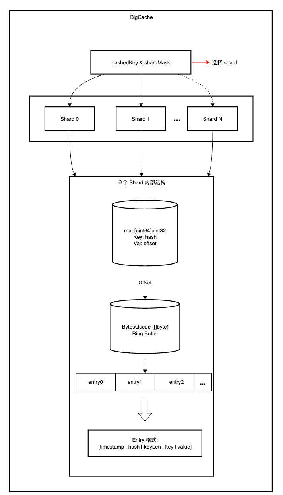
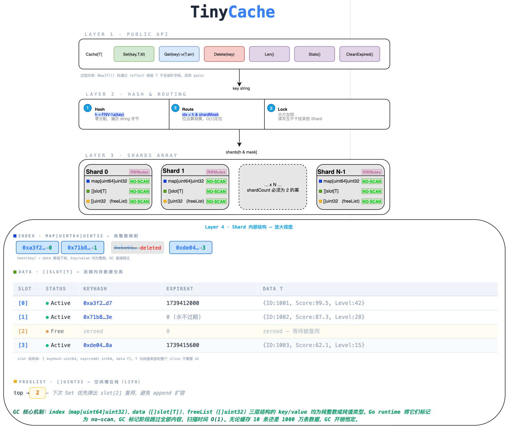
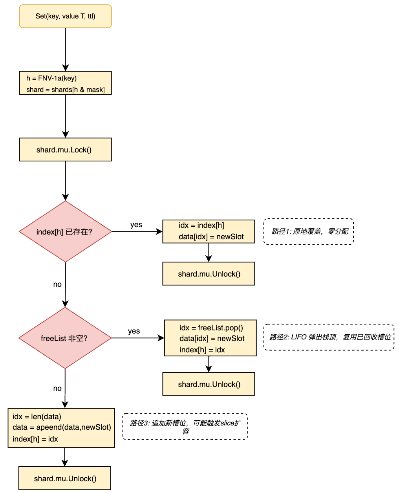
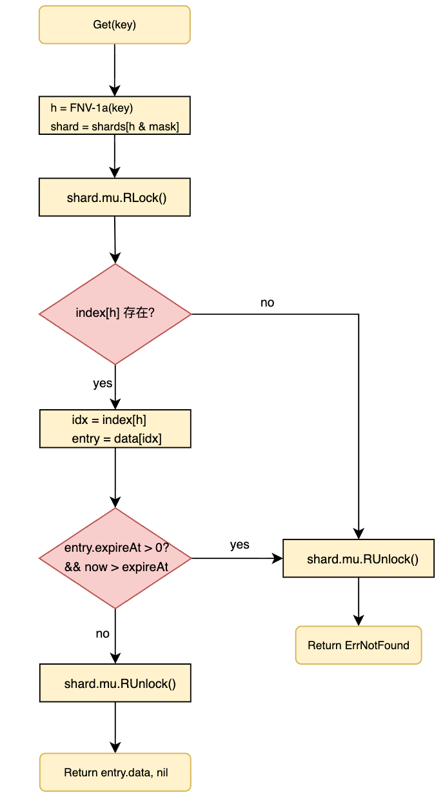
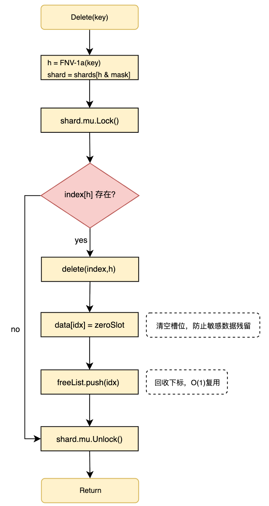

# 设计和实现高性能 Go 本地缓存

## 1. 前言

`tinycache` 是一个专为 Go 语言设计的高性能、泛型、线程安全的内存缓存库。它旨在解决在高并发和海量数据场景下，Go 原生 `map` 带来的垃圾回收（GC）延迟过高和锁竞争问题。本文将从 Go map 在大数据量缓存场景下的 GC 痛点出发，参考了业界主流开源库`BigCache`如何解决这个问题，并在此基础上设计一个自己的缓存库。

`tinycache`  借鉴了 `bigcache` 的"指针擦除"核心思想，同时在数据模型和内存管理上做了根本性改进——用**泛型 struct 数组**替代**序列化字节队列**，用 **FreeList 即时回收**替代 **FIFO 自然淘汰**。

## 2. Go map 在大数据量缓存场景下的痛点

### 2.1 map + RWMutex

常见的缓存实现中，一般都采用`map + rwmutex`的机制实现，假设当前是一个存储用户画像的缓存结构，常见的实现代码如下所示。

```go
type NaiveCache struct {
    mu   sync.RWMutex
    data map[string]*UserProfile // 存储用户画像
}
```

当数据量在几千、几万级别时，这种方案工作得很好。但当缓存条目达到**百万甚至千万级别**时，问题开始浮现。

### 2.2 GC 扫描风暴

Go 的垃圾回收器采用三色标记法，在标记阶段需要遍历堆上所有可达对象。对于 map 而言，GC 的行为取决于 key/value 的类型：

- **包含指针的 map**（如上述 demo 代码`map[string]*UserProfile`）：GC 必须扫描每一个 key 和 value，因为 string 底层包含指针（`StringHeader.Data`），`*UserProfile` 本身就是指针。1000 万条目意味着至少 2000 万个指针需要扫描。
- **不包含指针的 map**（如 `map[uint64]uint32`）：Go 1.5 引入的优化（[issue-9477](https://github.com/golang/go/issues/9477)）使得 GC 可以直接跳过这类 map 的内容，标记时间从 O(N) 降为 O(1)。

这里需要澄清一个常见误解：在现代 Go（1.12+）中，GC 的 STW（Stop-The-World）暂停时间本身已经极短（通常 <100µs），**与堆中指针数量几乎无关**。指针数量真正影响的是 **GC 并发标记阶段的 CPU 消耗**——Go 通过 mark assist 机制，在 goroutine 分配内存时强制其参与标记工作。指针越多，mark assist 越频繁，应用的有效吞吐量就越低。

```
STW Pause 1 (Mark Setup)       ← 极短，< 50µs，与堆大小几乎无关
     │
     ▼
Concurrent Mark (并发标记)       ← 真正的重活：遍历所有指针
     │                             与应用 goroutine 并发执行
     │                             通过 mark assist 抢占应用 CPU
     ▼
STW Pause 2 (Mark Termination)  ← 极短
     │
     ▼
Concurrent Sweep                ← 并发清扫
```

因此，衡量 GC 优化效果的正确指标不是 STW Pause，而是：

| 指标                      | 含义            | 为什么重要                    |
| ----------------------- | ------------- | ------------------------ |
| **HeapObjects**         | GC 追踪的堆对象数量   | 直接反映 GC 需要扫描的对象数         |
| **GCCPUFraction**       | GC 占总 CPU 的比例 | 指针越多 → 并发标记越重 → CPU 占比越高 |
| **Throughput Under GC** | GC 压力下的吞吐量    | 最贴近生产环境的综合指标             |

上述指标也是我们后文进行性能测试的重要对比指标。

### 2.3 其他问题

- **并发锁竞争**：单一的 `sync.RWMutex` 在高并发场景下会成为瓶颈。即使读锁（RLock）允许并发读取，在写操作频繁时，所有读操作仍会被短暂阻塞。当 QPS 达到数万甚至数十万时，锁争用会显著降低吞吐量。
- **内存只增不减**：go map 存在只扩不缩。在缓存场景中，流量高峰期 map 扩容后，低峰期即使大量条目被淘汰，底层 bucket 数组的内存也不会释放。

我们需要针对当前 Go map 在某些场景下面临的问题，一一进行解决，本方案的设计理念主要参考了`bigcache`的实现并针对性增加了一些改动。


## 3. bigcache 的核心设计

### 3.1 架构概览

[BigCache](https://github.com/allegro/bigcache) 由 Allegro 团队开源，是解决"大规模缓存 GC 问题"的标杆项目。它的设计围绕一个核心目标：让 GC 看不到你的数据。`bigcache`的架构示意图如图 1 所示：


*图1： bigcache 架构图*

`bigcache`的设计理念如下：

1. **索引** — key 是哈希值，value 是 BytesQueue 中的偏移量。两者都是基本整数类型，无指针，GC 直接跳过。
2. **分片降低锁粒度** — 默认 1024 个 shard，每个 shard 独立 `sync.RWMutex`，将锁争用概率降到 1/1024。
3. **数据序列化为** — 所有 key/value 序列化后追加到一个连续的 `[]byte` 数组（BytesQueue）。GC 只看到一个 slice 指针，而非 N 个独立对象。

### 3.2 局限

BigCache 面向的是"通用 KV 字节缓存"场景，`[]byte` 接口和 FIFO 淘汰在这个场景下是合理的设计选择。但如果我们面对的是"**已知类型的结构体缓存**"场景（缓存用户画像、行情快照、会话状态），它有几个值得改进的地方：

- **序列化开销**：所有数据必须编解码为 `[]byte`。在高 QPS 下，每次 Get/Set 的 `json.Marshal` / `binary.Write` 会产生大量临时堆分配，反而给 GC 带来额外压力——与优化的初衷矛盾。
- **FIFO 无法原地更新**：BytesQueue 是追加写的 FIFO 队列。更新同一个 key 时，旧 entry 原地作废，新 entry 追加到队尾。频繁更新同一批 key 会导致大量"死" entry 堆积。
- **无法显式回收**：Delete 只是从 index 中移除映射，BytesQueue 中的数据空间无法回收，只能等 FIFO 自然覆盖。
- **类型不安全**：接口是 `Get(key) → []byte`，用户需要自行处理序列化/反序列化，编译期无法发现类型错误。

## 4. tinycache 设计与实现

### 4.1 借鉴与改进

`tinycache` 从 `bigcache` 中借鉴了经过生产验证的核心思想，同时在数据模型和内存管理上走了一条不同的路。两者的关系可以用这张表概括：

| 设计维度                      | 借鉴 BigCache | TinyCache 的改进                          |
| ------------------------- | ----------- | -------------------------------------- |
| `map[uint64]uint32` 无指针索引 | ✅           | —                                      |
| 分片 + 独立 RWMutex           | ✅           | —                                      |
| FNV-1a 哈希                 | ✅           | 改为零分配内联版本                              |
| 哈希冲突覆盖策略                  | ✅           | —                                      |
| 数据存储                      | —           | `[]slot[T]` 随机访问数组，替代 `[]byte` FIFO 队列 |
| 内存回收                      | —           | FreeList 即时回收，替代 FIFO 自然淘汰             |
| 类型安全                      | —           | 泛型 `T` + reflect 运行时指针校验               |
| 过期清理                      | —           | 读路径惰性判定（不加写锁）+ 后台批量回收                  |

`bigcache` 是面向字节流的 FIFO 缓冲区，`tinycache` 是面向结构体的随机访问内存池。

### 4.2 整体架构

`tinycache`的整体架构如图 2 所示。

*图2：tinycache 架构*

### 4.3 核心数据结构

```go
// slot 是 data 切片中的存储单元
// 只要 T 不含指针，整个 []slot[T] 对 GC 而言是 no-scan 的
type slot[T any] struct {
    keyHash  uint64  // 完整 64 位哈希，用于 Get 时冲突校验
    expireAt int64   // 过期时间 (UnixNano)，0 表示永不过期
    data     T       // 用户业务数据（纯值类型 struct）
}

// shard 是真正的缓存执行单元
type shard[T any] struct {
    mu       sync.RWMutex
    index    map[uint64]uint32  // hash → slot 下标（纯整数GC 跳过）
    data     []slot[T]          // 连续内存数据仓库（无指针GC 跳过）
    freeList []uint32           // 空闲槽位栈 LIFO（纯整数GC 跳过）
}
```

在`shard`结构中，三个字段各司其职：

- `index` 是 `map[uint64]uint32`——key 和 value 都是整数类型，，GC 直接跳过。这一点**与 BigCache 完全一致**。
- `data` 是 `[]slot[T]`——**不同于 BigCache 的** `[]byte`，tinycache 直接存储原生 struct。只要 T 是纯值类型（通过运行时校验保证），整个 slice 对 GC 而言就是一块不含指针的连续内存。
- `freeList` 是 `[]uint32`——一个简单的整数栈，记录被删除/过期的槽位下标。下次 Set 时从栈顶弹出复用。**这是 BigCache 所不具备的机制**。

### 4.4 数据模型的差异

BigCache 的数据层是一个 FIFO 字节队列，只能从尾部追加，无法原地更新：

```
BigCache BytesQueue (只能追加):
┌──────┬──────┬──────┬──────┬────┐
│entry0│entry1│entry2│entry3│tail│  → 写入只能 append
└──────┴──────┴──────┴──────┴────┘
每个 entry 变长: [timestamp|hash|keyLen|key|value]
```

TinyCache 的数据层是一个 **随机访问 struct 数组**，通过下标直接定位和原地覆盖：

```
TinyCache []slot[T] (随机访问):
┌───────┬───────┬───────┬───────┐
│slot[0]│slot[1]│slot[2]│slot[3]│  → 通过下标 O(1) 原地读写
└───────┴───────┴───────┴───────┘
每个 slot 定长: {keyHash uint64, expireAt int64, data T}
```

这个差异导致了一系列连锁反应：

| 行为       | BigCache                        | TinyCache                            |
| -------- | ------------------------------- | ------------------------------------ |
| 更新已有 key | 旧 entry 作废 → 队尾追加新 entry（旧空间浪费） | `data[idx] = newSlot`，**原地覆盖，零浪费**   |
| 删除       | 无法物理回收，等 FIFO 自然淘汰              | 从 index 移除 + 下标归还 FreeList，**立即可复用** |
| 空间复用     | 不复用，依赖 FIFO 覆盖                  | **FreeList 显式管理**，删除后槽位立即可用          |
| 序列化      | 必须 encode/decode 为`[]byte`      | **零序列化**，直接操作 struct                 |
| 类型安全     | `[]byte`，运行时发现错误                | 泛型 `T`，**编译期类型检查**                   |

### 4.5 主要方法

同其他 cache 一样，TinyCache 提供了Set、Get、Del 等操作。

#### 4.5.1 Set

`Set` 写入操作为了最大化降低内存分配并避免切片无节制扩容，TinyCache 在锁定单个 `Shard` 后，采用了严格的**三级降级优先策略**：

- **路径 1：原地覆盖更新**

    - **触发条件**：哈希键 `index[h]` 已存在（通常是更新已有 Key，或者是极低概率的哈希冲突）。
    - **执行逻辑**：直接通过存在的 `idx` 覆盖底层 `data[idx]` 的数据。
    - **性能影响**：最佳状态。时间复杂度严格 $O(1)$，仅发生一次内存值的拷贝替换，**零堆分配（0 Alloc）**，不会引起底层数据结构的任何形变。

- **路径 2：槽位复用**

    - **触发条件**：当前是新 Key 写入，且 `freeList`（回收栈）中存在之前因 `Delete` 或 `CleanExpired` 废弃的槽位。
    - **执行逻辑**：从 `freeList` 的尾部弹出（Pop）一个废弃槽位的索引 `idx`（LIFO 后进先出策略可以提升 CPU 缓存的局部性命中率），将新数据写入该位置，并更新哈希索引。
    - **性能影响**：次佳状态。时间复杂度 $O(1)$，**零堆分配（0 Alloc）**。有效抑制了底层数组的无限增长，实现了缓存空间的自我循环。

- **路径 3：追加扩容**

    - **触发条件**：当前是新 Key 写入，且 `freeList` 已耗尽（通常发生在缓存实例刚启动的“预热填充期”）。
    - **执行逻辑**：调用 Go 原生的 `append` 函数，将新 `slot` 追加到 `data` 切片末尾，并记录新的索引下标。
    - **性能影响**：兜底路径。平摊时间复杂度为 $O(1)$。当切片容量（`cap`）不足时，会触发 Go Runtime 的底层数组扩容机制（通常为 $1.25$ 或 $2$ 倍增长），此时会产生**内存分配与数据拷贝开销**。


图3展示了 TinyCache 进行 `Set` 操作的流程。


*图3: tinycache set操作流程*

对应的实现代码如下：

```go
func (s *shard[T]) set(keyHash uint64, value T, ttl time.Duration) {
    var expireAt int64
    if ttl > 0 {
        expireAt = time.Now().Add(ttl).UnixNano()
    }

    entry := slot[T]{
        keyHash:  keyHash,
        expireAt: expireAt,
        data:     value,
    }

    s.mu.Lock()
    defer s.mu.Unlock()

    // 路径 1：key 已存在（更新）或哈希冲突（覆盖）
    if idx, ok := s.index[keyHash]; ok {
        s.data[idx] = entry
        return
    }

    // 路径 2：从 freeList 复用空闲槽位
    if n := len(s.freeList); n > 0 {
        freeIdx := s.freeList[n-1]     // LIFO: 弹出栈顶
        s.freeList = s.freeList[:n-1]
        s.data[freeIdx] = entry
        s.index[keyHash] = freeIdx
        return
    }

    // 路径 3：追加到 data 尾部
    idx := uint32(len(s.data))
    s.data = append(s.data, entry)
    s.index[keyHash] = idx
}
```

路径 1 和路径 2 都是零分配的——不触发 slice 扩容，不产生临时对象。在缓存稳定运行一段时间后（经历过一轮增删），大部分 Set 操作会命中路径 1 或路径 2，路径 3 只在初始填充阶段频繁触发。

#### 4.5.2 Get

`Get` 读取操作在缓存系统中通常占据 90% 以上的流量。为了在保证数据绝对安全的前提下实现高吞吐量，TinyCache 的 `Get` 操作在仅持有**读锁（`RLock`）** 的状态下进行读取操作。其核心执行流采用了串行的防御机制，依次包含索引命中校验与惰性过期判定。

- **索引命中**

    - 直接查询 `map[uint64]uint32` 。由于 Map 的 Key 和 Value 都是基础数字类型，此操作避开了 GC 扫描 ，若未命中，直接释放读锁并返回 `ErrNotFound`。

- **惰性过期判定**

    - 检查条目的 `expireAt` 时间戳 。当发现数据已过期时 TinyCache 绝对不会在此处尝试删除数据（删除操作将锁升级为互斥写锁）。相反，它仅仅静默返回 `ErrNotFound`，将物理清理工作完全下放给后期的覆盖写入或后台的定时清理协程。


*图4: tinycache get操作流程*

对应实现的代码如下：

```go
func (s *shard[T]) get(keyHash uint64) (T, error) {
    s.mu.RLock()
    defer s.mu.RUnlock()

    idx, ok := s.index[keyHash]
    if !ok {
        var zero T
        return zero, ErrNotFound
    }

    entry := s.data[idx]

    // 哈希冲突校验，后续版本优化
    /*if entry.keyHash != keyHash {
        var zero T
        return zero, ErrNotFound
    }*/

    // 过期检查（惰性判定，不在读路径加写锁清理）
    if entry.expireAt > 0 && time.Now().UnixNano() > entry.expireAt {
        var zero T
        return zero, ErrNotFound
    }

    return entry.data, nil
}
```

**读路径不加写锁** — 过期条目被发现后只返回 NotFound，不做删除/清理。这避免了在高 QPS 读路径上升级为写锁导致的性能退化。过期条目由 `CleanExpired()` 后台协程统一回收。
**值拷贝** — `return entry.data` 在 Go 的值语义下是 struct 拷贝。调用方拿到的是独立副本，读锁释放后即使槽位被覆盖也不影响已返回的数据。

#### 4.5.3 delete

TinyCache 与 BigCache 在删除（Delete）操作上的内存回收策略存在显著的架构差异。

BigCache 的删除操作仅执行索引层面的逻辑解绑，其 BytesQueue 中的物理数据空间无法被主动回收，必须依赖 FIFO 淘汰机制在后续追加写入时自然覆盖。相反，TinyCache 通过 FreeList 结构实现了确定性的空间即时回收与复用。

具体而言，TinyCache 的 Delete 操作不会触发底层 `data` 切片的缩容操作（避免了物理内存释放与再分配的开销），而是将目标数据的存储槽位（Slot）清零后，将其对应的数组下标压入 FreeList 栈中。在后续的 Set 写入操作中，系统会优先从 FreeList 栈顶弹出可用下标，实现对底层空闲槽位的原地覆写。删除操作流程如图5所示。


*图5: tinycache del操作流程*

对应的代码实现逻辑如下：

```go
func (s *shard[T]) del(keyHash uint64) {
    s.mu.Lock()
    defer s.mu.Unlock()

    idx, ok := s.index[keyHash]
    if !ok {
        return
    }

    delete(s.index, keyHash)

    var zeroSlot slot[T]
    s.data[idx] = zeroSlot

    s.freeList = append(s.freeList, idx)
}
```

### 4.6 其他方法

除了常用的Set、Get、Del操作外，为了实现 TinyCache 的在高性能方面的优化，还实现了其他的辅助类方法。

#### 4.6.1 指针安全检查

TinyCache 的 GC 优化建立在一个刚性前提上：`[]slot[T]` 不包含任何指针。一旦 T 中出现 string、slice、map、pointer 等类型，整个优化就失效了。

由于 Go 的泛型系统目前无法在**编译期**约束"T 不含指针字段"，TinyCache 在 `New[T]()` 时通过 reflect 进行运行时校验：

```go
func assertNoPointers[T any]() {  
    t := reflect.TypeOf((*T)(nil)).Elem()  
    
    if path := findPointerField(t, ""); path != "" {  
       panic(fmt.Sprintf(  
          "tinycache: type %q contains pointer at %s — "+  
             "this breaks the GC optimization. "+  
             "All fields must be value types (int, float, bool, fixed-size arrays, etc.)",  
          t.String(), path,  
       ))  
    }  
}
```

`findPointerField` 会递归遍历 T 的每一个字段，发现指针类型时 panic 并报出**具体的字段路径**：

```go
func findPointerField(t reflect.Type, prefix string) string {  
    switch t.Kind() {  
  
    // 显式指针类型  
    case reflect.Ptr, reflect.Map, reflect.Slice,  
       reflect.Chan, reflect.Func, reflect.Interface, 
       reflect.UnsafePointer:  
       if prefix == "" {  
          return t.String() + " (root type is a pointer type)"  
       }  
       return prefix  
  
    // string 底层含指针（StringHeader.Data）  
    case reflect.String:  
       if prefix == "" {  
          return "string (root type contains pointer)"  
       }  
       return prefix  
  
    // struct 需要递归检查每个字段  
    case reflect.Struct:  
       for i := 0; i < t.NumField(); i++ {  
          field := t.Field(i)  
          fieldPath := field.Name  
          if prefix != "" {  
             fieldPath = prefix + "." + field.Name  
          }  
          if result := findPointerField(field.Type, fieldPath); result != "" {  
             return result  
          }  
       }  
       return ""  
  
    // 固定长度数组需要检查元素类型  
    case reflect.Array:  
       elemPath := prefix + "[]"  
       if prefix == "" {  
          elemPath = "[]"  
       }  
       return findPointerField(t.Elem(), elemPath)  
  
    default:  
       // bool, int*, uint*, float*, complex* 等基本值类型  
       return ""  
    }  
}
```

拒绝的类型：`*T`、`map`、`slice`、`chan`、`func`、`interface`、`string`、unsafe.Pointer。接受的类型：`int/uint/float/complex/bool` 系列、固定长度数组（元素也必须无指针）、struct（所有字段都无指针）。

#### 4.6.2 hash函数

参照 BigCache 使用的 FNV-1a 哈希算法，但是其通过调用标准库 `hash/fnv`实现：

```go
// BigCache 的哈希方式（每次调用有堆分配）
h := fnv.New64a()          // 分配 hash.Hash64 接口对象，逃逸到堆
h.Write([]byte(key))       // string → []byte 转换，又一次堆分配
return h.Sum64()
```

TinyCache 使用手写的零分配内联版本，直接参考的`hash/fnv`中的`New64a()`及其`Write`方法的实现：

```go
// TinyCache 的哈希方式（零堆分配）
func fnvHash(key string) uint64 {
    h := uint64(14695981039346656037) // FNV offset basis
    for i := 0; i < len(key); i++ {
        h ^= uint64(key[i])
        h *= 1099511628211            // FNV prime
    }
    return h
}
```

直接遍历 string 底层字节，避免了 `[]byte` 转换和接口对象分配。理论上，在 10 万 QPS 下，BigCache 的哈希方式每秒会产生约 20 万次堆分配；TinyCache 版本为零。

#### 4.6.3 哈希冲突

与 BigCache 一致，TinyCache 采用**覆盖策略**——如果两个不同的 key 产生相同的哈希值，后写入的会覆盖先写入的。由于 TinyCache 不存储原始 key（string 含指针，无法存入 no-scan 的 slot），冲突检测能力弱于 BigCache（BigCache 在 BytesQueue 中存储了完整的 key bytes，可以做精确的字符串比对）。使用 64 位哈希函数时，根据生日悖论，**当缓存中同时存活的 key 数量达到** $2^{32}$（约 43 亿）**时，发生至少一次哈希碰撞的概率约为 50%**。对于百万到千万级缓存场景，这一概率微乎其微，基本可以忽略。

>在后续的架构演进中，可考虑引入双重哈希校验机制，以极小的内存代价（如 4 字节的 CRC32 校验码）来消除哈希冲突导致的脏数据读取风险。

## 5. todo list

- [ ] data slice 只增不减，增加淘汰策略；
- [ ] 冲突检测能力有限，TinyCache 不存储原始 key（string 含指针），只用 uint64 hash 做校验。精度弱于 BigCache（BigCache 在 BytesQueue 中存储了完整 key bytes 可做精确比对）。可考虑引入双哈希校验（FNV-1a + 第二哈希函数）降低误判率。
- [ ] T 必须是纯值类型：这是 GC 优化的刚性约束。

